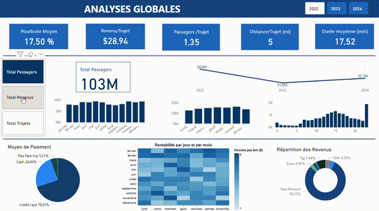

# 🚀 Yellow Taxi MeteoRide: ## Analyse corrélative des conditions météorologiques et des trajets en taxi 📊

## 📝 Présentation du Projet
Ce projet analyse la corrélation entre les conditions météorologiques et plus de 100 millions de courses de taxi à New York. En exploitant un pipeline ELT sur GCP et une couche de visualisation Power BI, nous transformons des données brutes de trajets et de météo en insights actionnables pour comprendre les patterns de mobilité urbaine en fonction des conditions climatiques. L'objectif est d'offrir une meilleure compréhension de l'influence météorologique sur les comportements de déplacement, permettant ainsi d'optimiser la répartition des taxis selon les conditions atmosphériques observées.

**Démo du Tableau de Bord**




🔍 **Caractéristiques du Jeu de Données**  
- **Sources** : NYC Taxi & Limousine Commission (trips CSV), Automated Observation System (AOS, météo horaires)  
- **Période** : historique mensuel sur plusieurs années  
- **Volume** : plus de 100 millions de courses et observations météo pour plusieurs dizaines de stations

---

## Architecture du système
Le pipeline suit une architecture ELT robuste sur Google Cloud Platform (GCP) :

```
NYC.gov (trips CSV)  ──┐
                       │
Weather API (AOS)   ──>│
                       │
                       v
                Airflow (Orchestration)
                       │
                       v
                GCS (Stockage brut)
                       │
                       v
               BigQuery (tables raw)
                       │
                       v
                    dbt (Transformation)
                       │
                       v
                BigQuery (tables marts)
                       │
                       v
                     Power BI
```


## Composants techniques

### Étape 1 : Extract → GCS  
- Harvest mensuel automatisé des CSV taxi (NYC.gov) et météo (AOS) via Airflow  
- Organisation et versioning des dizaines de Go de données dans GCS  
- Gestion des fichiers bruts avec un partitionnement efficace

### Étape 2 : Load → BigQuery  
- Ingestion dans deux tables **raw** : `trips` et `raw_weather_data`  
- Surveillance des échecs d’ingestion et gestion des doublons  
- Contrôles de qualité (format, complétude)

### Étape 3 : Staging avec dbt  
- **Nettoyage** : suppression des enregistrements incomplets ou aberrants  
- **Typage & conversions** : uniformisation des formats (timestamps, unités, géolocation)  
- **Enrichissement** :  
  - Dimensions temporelles (heure, jour de semaine)  
  - Mapping géographique : zone taxi ↔ station météo  
- **Quality Gates** : tests automatiques (not_null, accepted_values) avant chaque exécution

### Étape 4 : Transform  
- Création de tables **intermédiaires** classifiant chaque course et observation météo  
- Isolation des anomalies avant agrégations pour détection précoce des problèmes  
- **Marts spécialisés** :  
  - **Data Quality** : suivi des anomalies  
  - **Full-Volume** : toutes courses pour analyses volumétriques  
  - **Valid-Only** : courses validées pour dashboards fiables  
  - **Fact Hourly** : historisation horaire avec 45+ métriques météo  
  - **Agrégations** partitionnées par date, zone et condition météo

### Étape 5 : Visualisation  
- Stratégie **Import** vs **DirectQuery** selon les volumétries  
- Optimisation des requêtes BigQuery pour réduire la latence  
- Configuration Power BI (rapports, slicers, KPI) pour garantir fluidité et performance

---

## Défis techniques résolus

- **Asymétrie des données** : courses au pas de minute vs météo à l’heure  
  **Solution** : partitionnement intelligent synchronisant fenêtres temporelles course/météo  
  **Résultat** : optimisation des temps de requête et précision des analyses

- **Scalabilité & performance** :  
  - Tests automatiques à chaque déploiement  
  - Modèles incrémentaux avec partitionnement  
  - Macros dbt pour code réutilisable  
  **Résultat** : pipeline ELT modulable et performant sur GCP

## Contact  
Pour plus d'informations sur ce projet, veuillez me contacter sur LinkedIn : [François Vercellotti](https://www.linkedin.com/in/fran%C3%A7ois-vercellotti-3687492a8)


## Licence  
Ce projet est sous licence MIT.

